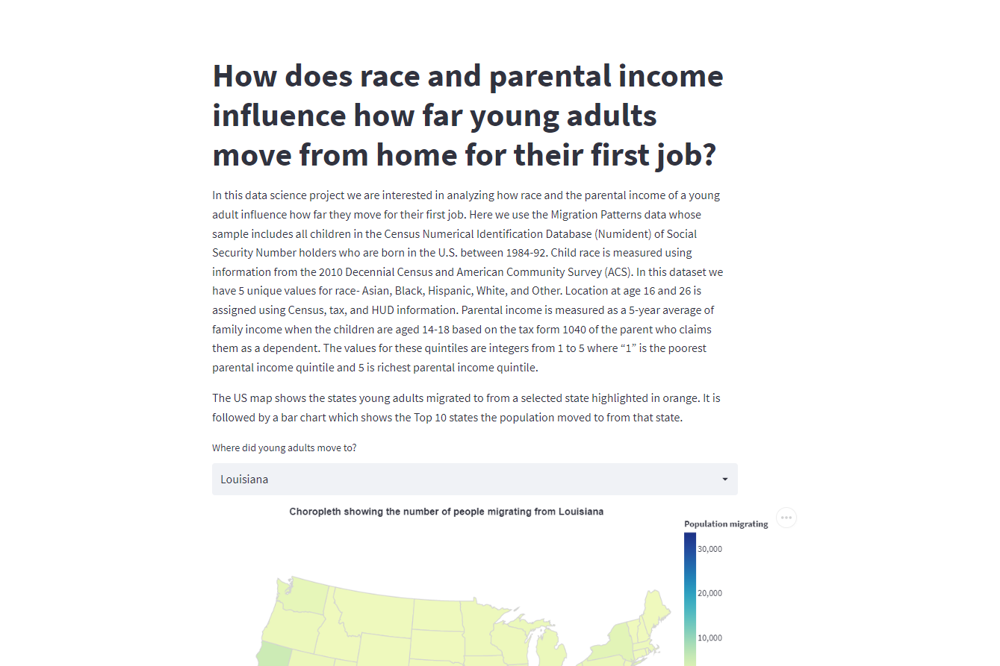

# Project name

Linl: https://adni03-migration-patterns-streamlit-app-px2bq5.streamlit.app/

The aim of this data science project is to analyze the influence of race and parental income on the migration patterns of young adults for their first job away from home. 

## Project Goals
The question we want to answer, "How does race and parental income influence how far young adults move from home for their first job?" is an intriguing insight into migration patterns. We analyze the trends of migration by race and parental income quintiles for multiple states to uncover trends if any.   

## Design
Using visual encodings which are simple and intuitive to the user was our primary focus. For the project we have used a chloropeth US Map which is quite simple to understand, and multiple bar charts which show the most popular states, the numbers of young adults moving by race and distances. We used a donut chart to show the proportion of individuals moving in each quintile to provide the users a visual depiction of change. Interaction techniques incorporated are using brushes for selection of specific bars in the charts which transform corrsponding charts. We considered using line charts, however that approach did not seem infomative for the data we use, we also considered using stacked bar charts but decided against it as the separation of the quintile values became difficult. Our decision to go ahead with bar charts and donut chart was to allow maximum interpretability of the data to the user in simple form. 

## Development
Our first task was to scope out the project and decide what exactly we wanted to answer from the data. Once that was decided, one member first started with the data manipulation and formatting to bring the data into a format we could use for visualizations. The other member brainstormed and sketched out the designs we could use. Once we had a template ready, both of us took up different tasks to visalize and completed the development working collaboratively. Despite running into some issues, we were able to get the app running. Working together we approximately spent 40 person hours on the project, a majority of the time was spent on analyzing the questions and the kind of visualizations that would best answer the question. 

## Success Story
An interesting insight we made while analyzing the data for this project is that migration patterns are heavily dependent on the parental income of the young adults moving. While anlyzing the data for multiple states, we saw that while White young adults moved the maximum in numbers away from their homes, it was interesting to note that young adults belonging to Quintile 5 (richest parental income) moved the most. In contrast, the Black and Hispanic young adults belonging to Quintile 1 (poorest parental income) moved the most.

#### Note:
 - Streamlit deployment issues. The app works fine locally. Numeric values are null when deployed. 
 - Original data file was processed using methods found in data_agg.py. The original data files are too large.
